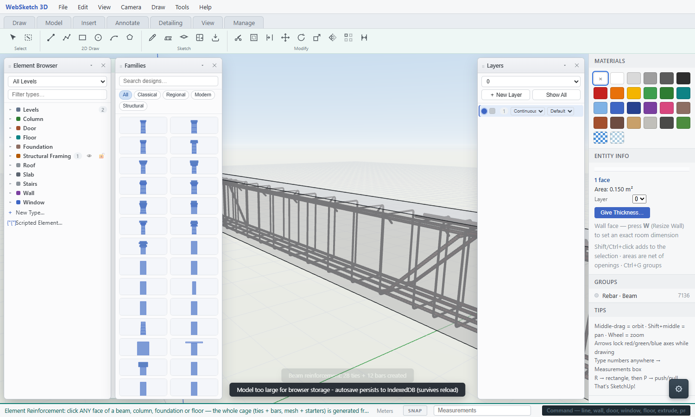
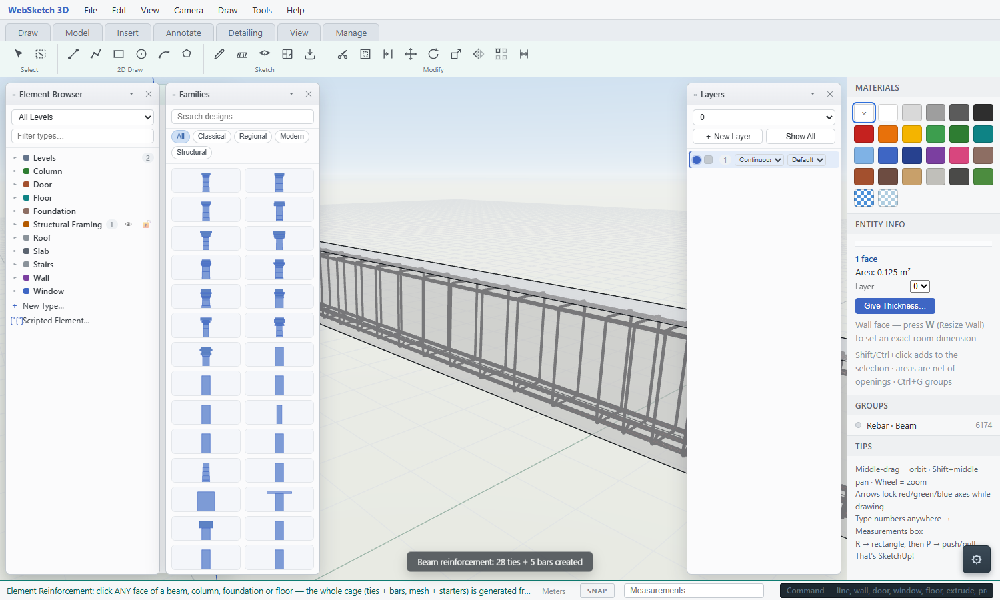
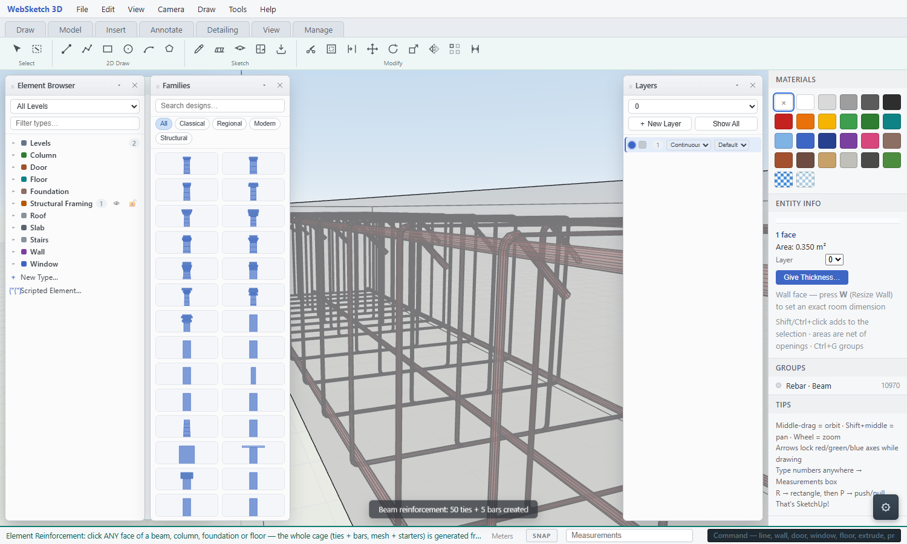
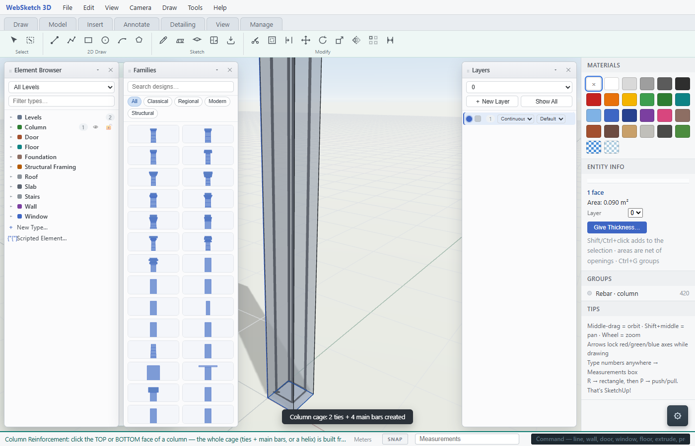
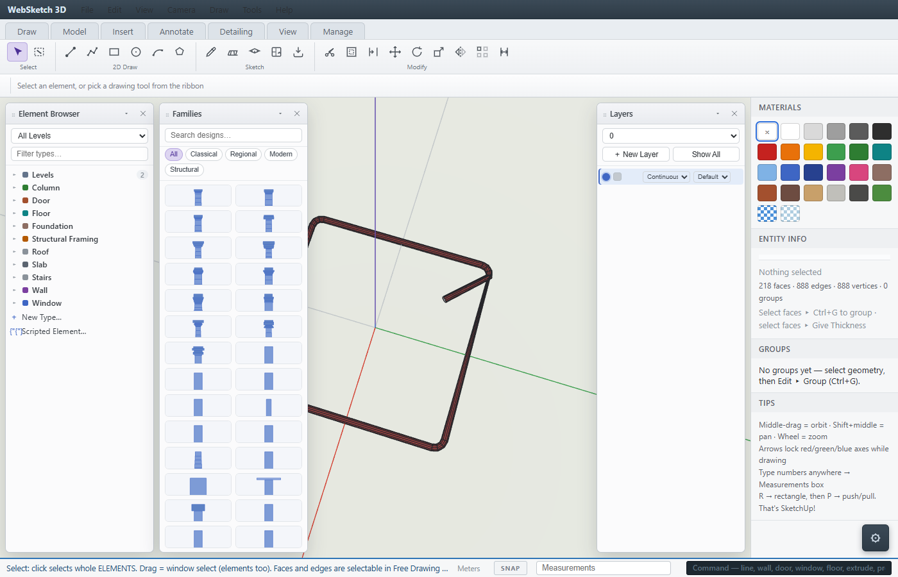
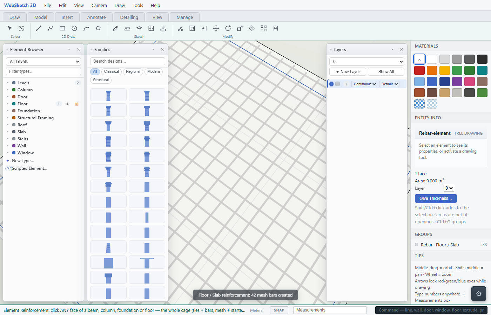
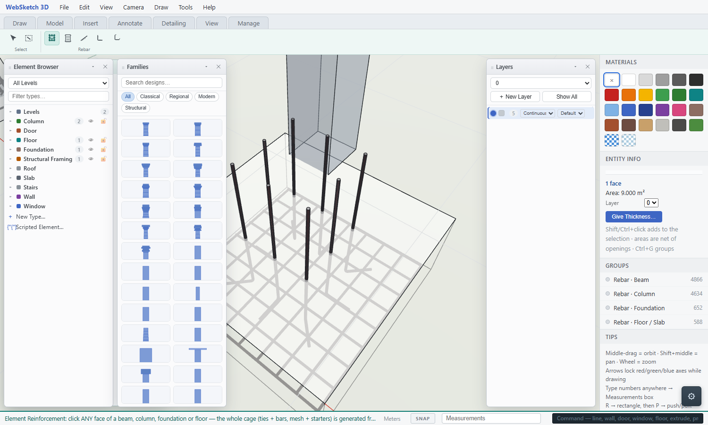
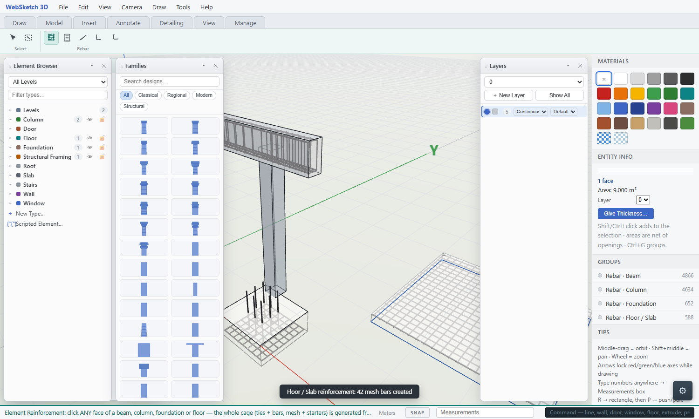

# ACI 318-19 Reinforcement Detailing — Element by Element

This document explains the rebar detailing rules the app applies for each
structural element, with the ACI 318-19 clause references and a render from
the app showing the finished cage. Rules already implemented are marked
**[implemented]**; rules being added in the current pass are marked
**[new]**.

Sources: [ACI CODE-318-19](https://www.concrete.org), [UpCodes §25.2](https://up.codes),
[ideCAD detailing help](https://help.idecad.com), [structurepoint](https://structurepoint.org),
[Calctree column limits](https://www.calctree.com), [Eastern Engineering skin steel](https://www.easternengineeringgroup.com).

---

## 1. Beams (Ch. 9 flexure, Ch. 25 detailing, Ch. 18 seismic)

**Longitudinal bars**
- Minimum 2 continuous bars top and bottom — **[implemented]** (top/bottom rows default 2/3).
- Clear spacing between bars in a layer ≥ **max(db, 25 mm, 4/3 da)** (§25.2.1)
  — **[implemented]**: the layering fallback fires at max(db, 25 mm).
- Second layer at **25 mm clear** vertical offset — **[implemented]**.

**Skin reinforcement (§9.7.2.3)**
- Where effective depth **d > 900 mm (36 in.)**, skin steel on both faces
  distributed over h/2 from the tension face, spacing ≤ ~**250–300 mm**
  (10–12 in.) — **[new]**: skin bars auto-insert when d > 900 mm.

**Shear reinforcement (stirrups)**
- Standard: s ≤ min(**d/2**, 600 mm) — **[implemented]** (mid-span rule).
- Seismic (§18.6.4): confinement zones **2h** from the support face at
  s ≤ min(**d/4, 100 mm**) (we use 125 mm per the owner's rule, between
  the 4 in. hoop limit and d/4) — **[implemented]**.
- First stirrup **50 mm** from the support face — **[implemented]**.

**Multi-leg rule (wide beams)**
- Clear spacing between legs of shear reinforcement ≤ **300 mm** (12 in.),
  inner hoops around intermediate bars — **[implemented]**.

**Standard hooks (Table 25.3.1)**
- 90° hook: inside bend **6 db** (bars ≤ No. 8 / 25 mm), extension **12 db**
  — **[implemented]**.
- 180° hook: inside bend **6 db**, extension ≥ **max(4 db, 65 mm)** —
  **[implemented]** (we use 12 db uniform for simplicity).
- Stirrup seismic hook 135° with tail ≥ **max(6 db, 75 mm)** — **[implemented]**.

**Curtailed / bent-up bars (ACI 315 conventions)**
- Extra top bars: **Ln/4** from the support face — **[implemented]**.
- Extra bottom bars: stop **Ln/8** short of supports — **[implemented]**.
- Bent-up bars at **45°** starting ~Ln/6 from the face — **[implemented]**.

---

## 2. Columns (Ch. 10, §25.7 ties, Ch. 18 seismic)

**Longitudinal bars (§10.6.1)**
- Reinforcement ratio **0.01 Ag ≤ ρ ≤ 0.08 Ag** — **[new]**: the cage
  dialog now shows the ratio and warns outside the band.
- Minimum 4 bars (rectangular), 6 (circular) — **[implemented]** defaults.
- Clear spacing ≥ **max(1.5 db, 40 mm)** (§25.2.3) — **[implemented]** via
  the layered spread (second layer fallback).

**Ties (§25.7.2)**
- Standard spacing: s ≤ **min(16 db, 48 dtie, least column dimension)**
  — **[new]**: a "Standard ties" mode computes exactly this; seismic mode
  keeps the 2h/limit zones.
- Every corner and alternate bar restrained; unsupported bar ≤ 150 mm
  from a tied bar — **[implemented]** by nesting arcs at every corner.

**Seismic (§18.7.5)**
- Hoops in the plastic-hinge region at s ≤ min(bmin/4, 6 db, so) —
  **[implemented]** as the 2h confinement zones with d/4 cap.

**Stirrup geometry**
- **One continuous closed loop** wrapping all corner bars on nesting arcs
  (bend centre = corner bar axis) — **[implemented]**.
- 135° seismic lap alternating top corners, tails inside the cover —
  **[implemented]**.

---

## 3. Slabs / Floors (Ch. 7 one-way, Ch. 8 two-way)

**Minimum reinforcement (§7.6.1 / §8.6.1)**
- As ≥ **0.0018 Ag** (Grade 60) each direction — **[new]**: the slab
  generator reports the provided ratio and caps spacing to meet it.
**Maximum spacing**
- s ≤ min(**3h, 450 mm**) (one-way critical sections: min(2h, 450 mm))
  — **[new]**: spacing auto-caps at min(3h, 450 mm).
**Two-way clipping**
- Bars clipped to the real outline, openings split bars, slivers drop —
  **[implemented]**.
**Top mesh** — optional second layer at the top cover — **[implemented]**.

---

## 4. Foundations / Footings (Ch. 13)

**Minimum reinforcement**
- As ≥ **0.0018 Ag** each way (shrinkage/temperature, Grade 60) — **[new]**:
  the footing dialog reports the provided ratio per direction.
**Spacing** — s ≤ min(3h, 450 mm) — **[new]**: same cap as slabs.
**Column starters (dowels)**
- L-shaped: leg into the footing above the mesh, riser to a lap above the
  pad/pedestal; section auto-detected from the column standing on it —
  **[implemented]**.
- A column standing on the footing overrides the starter grid —
  **[implemented]**.

---

## 5. All elements together

The Element Reinforcement tool picks any face of a beam, column,
foundation or floor and builds the whole cage from the rules above; the
Bar Bending Schedule aggregates every bar with weights at
0.006165·d² kg/m.

---

## Summary table

| Rule | Clause | Status |
|---|---|---|
| Beam clear spacing ≥ max(db, 25) | 25.2 | implemented |
| Beam second layer 25 mm clear | 25.2 | implemented |
| Skin steel when d > 36 in. | 9.7.2.3 | **new** |
| Stirrup s ≤ d/2 mid-span | 9.7.6.2 | implemented |
| Seismic zones 2h, s ≤ d/4 | 18.6.4 | implemented |
| First stirrup 50 mm | 18.6.4 | implemented |
| Stirrup legs ≤ 300 mm | 9.7.6.2/18 | implemented |
| 90° hook: 6 db bend, 12 db ext | 25.3.1 | implemented |
| 180° hook: 6 db bend | 25.3.1 | implemented |
| Seismic hook 135°, ≥max(6db,75) | 25.3.1 | implemented |
| Column ρ 0.01–0.08 | 10.6.1 | **new** |
| Column ties min(16db,48dt,b) | 25.7.2 | **new** |
| Slab As ≥ 0.0018 | 7.6.1 | **new** |
| Slab s ≤ min(3h, 450) | 7.6.1 | **new** |
| Footing As ≥ 0.0018 | 13.3.2/24.4 | **new** |
| Curtail top Ln/4, bottom Ln/8 | ACI 315 | implemented |
| Bent-up bars 45°, Ln/6 | ACI 315 | implemented |
