# WebSketch 3D — Architecture & Drawing Engine

This document explains how the application is built: the layering, the
boundary-representation (B-Rep) drawing engine at its core, the parametric
BIM layer on top of it, and every major pipeline (input → transaction →
geometry → render → export) with flowcharts and graphs.

All diagrams are [Mermaid](https://mermaid.js.org/) — GitHub renders them
natively.

## Table of contents

1. [System overview](#1-system-overview)
2. [The drawing engine: B-Rep data model](#2-the-drawing-engine-b-rep-data-model)
3. [Input pipeline: from mouse to geometry](#3-input-pipeline-from-mouse-to-geometry)
4. [Transactions, undo and the guard](#4-transactions-undo-and-the-guard)
5. [Face healing: draw, punch, split, arrange](#5-face-healing-draw-punch-split-arrange)
6. [Push/Pull — the sweep kernel](#6-pushpull--the-sweep-kernel)
7. [Parametric BIM layer](#7-parametric-bim-layer)
8. [Hosted openings (doors / windows)](#8-hosted-openings-doors--windows)
9. [Structural elements & dynamic walls](#9-structural-elements--dynamic-walls)
10. [Rendering pipeline](#10-rendering-pipeline)
11. [Persistence & export](#11-persistence--export)
12. [Testing](#12-testing)
13. [Feature SDK (extension surface)](#13-feature-sdk-extension-surface)

---

## 1. System overview

Three layers with a strict downward dependency rule — the kernel never knows
a feature exists, features never touch kernel internals:

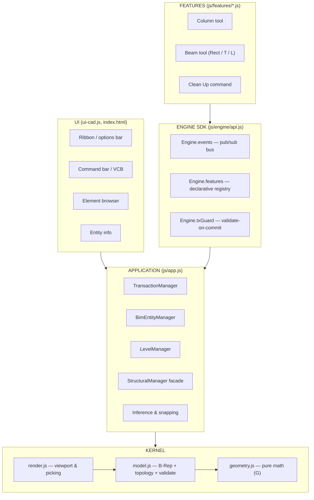

Key property: **everything mutates through a transaction** and every
notification is **push** (`Engine.events`), never polling.

## 2. The drawing engine: B-Rep data model

The model is a boundary representation: solids are shells of faces, faces
are rings of vertices connected by edges. Arcs/circles are segment chains
sharing a `curveId` (metadata lives in `curves`).

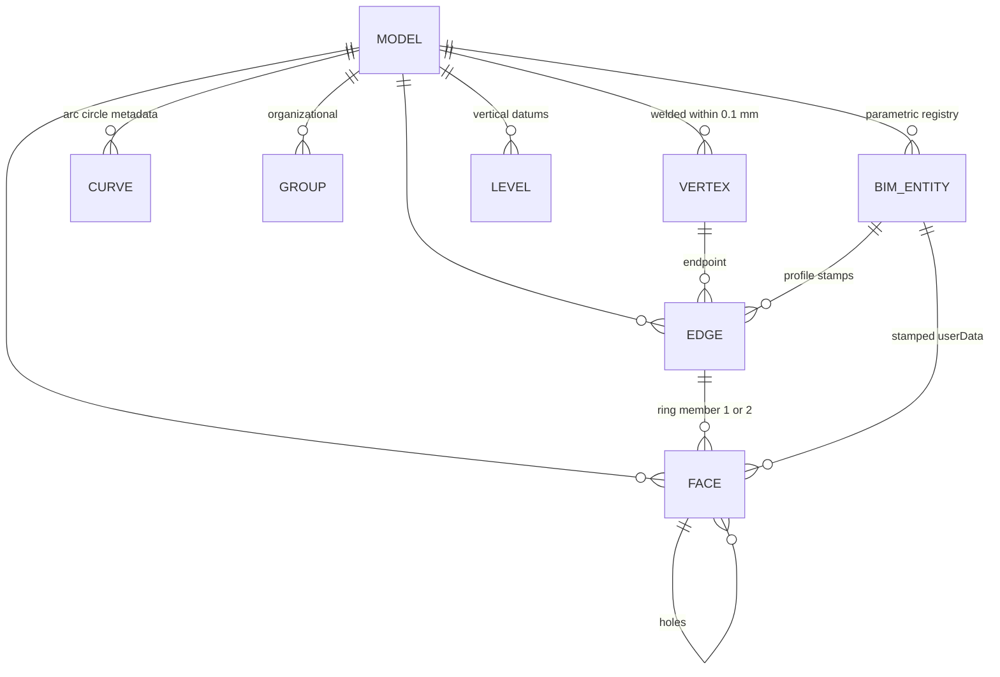

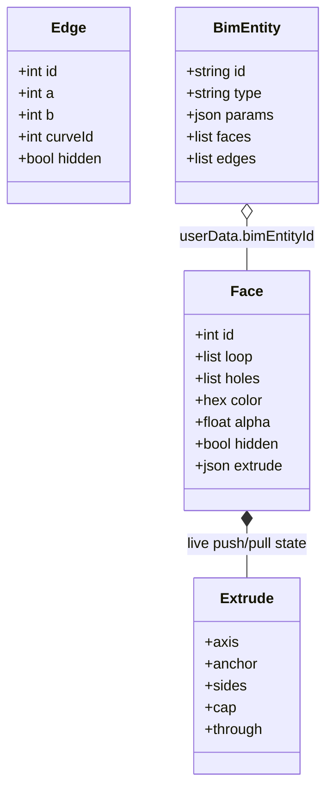

**Invariants** (each enforced in one place, unit-tested in `test/`):

| # | Invariant | Where |
|---|---|---|
| 1 | Vertices closer than `WELD_EPS` (0.1 mm) share one id — drawn geometry connects instead of floating | `Model.vertexAt` (spatial hash) |
| 2 | No T-junctions: a point landing on an edge splits it, in every referencing ring | `weldVertex / splitEdgeAt` |
| 3 | No double faces / internal partitions: coincident quads mean union — the partition is deleted | `pushPull` twin culling |
| 4 | Every ring pair has an edge; shells are valid or the transaction rolls back | `validate()` + tx guard |

### 2a. Kernel indexes (why drags stay smooth as models grow)

Every kernel operation used to be a full scan — `findEdge` walked all edges,
`gc()` invalidated the whole vertex weld hash (so the next weld rebuilt it
over every vertex), and `autoIntersect` recomputed both face AABBs for every
candidate pair. Each is fine at 50 faces and effectively quadratic by a few
hundred — which is exactly where "dragging an element feels laggy" came
from. Three indexes keep the hot paths near constant-time:

| Index | Maintained by | Answers |
|---|---|---|
| `_edgeIndex` — canonical vertex-pair → edge id | `_addEdge` / `_delEdge`; every edge mutation funnels through them, `load()` rebuilds | `findEdge(a, b)` in O(1) |
| `_vh` — 0.2 mm spatial hash of vertices | incremental `_vhAdd` / `_vhRemove` on create, move (`setVertex`), and `gc()` — never wholesale-invalidated mid-edit | tolerance welding in O(1) |
| per-scan AABB memo | `autoIntersect` caches each face's box, dropping entries only for faces an intersection mutated | broad-phase overlap without re-boxing |

One flag on top: `model.noAutoIntersect`. Placement **previews** (the
Scripted Elements drag ghost) build disposable geometry that is deleted the
moment the preview refreshes, so intersecting it with the model is pure
waste — with the flag set, a full Fire Stair ghost build costs ~2 ms on a
small model (was ~90 ms) and stays interactive into the thousands of faces.

## 3. Input pipeline: from mouse to geometry

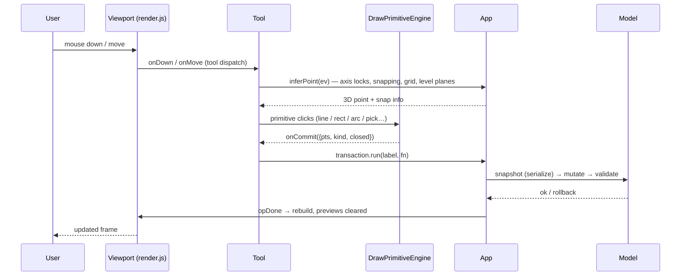

Free-mode tools (Line, Rect, Push/Pull…) call `model.addEdge /
addFaceFromRings / pushPull` directly. Precise-mode tools share the same
kernel but wrap results in **parametric entities** (§7).

## 4. Transactions, undo and the guard

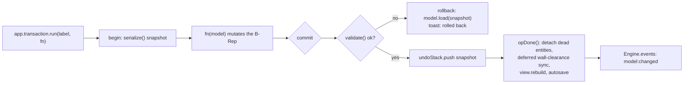

Undo/redo are pure snapshot swaps — no inverse operations to write or get
wrong. Snapshots deep-copy every array a later edit mutates in place.

## 5. Face healing: draw, punch, split, arrange

Drawing a closed loop on existing coplanar geometry never creates overlaps —
the kernel partitions instead (`punchOrSplit`):

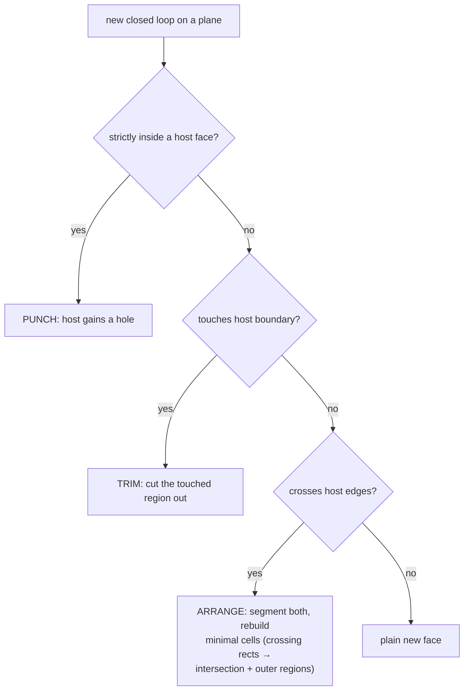

Edge erase (`dissolveEdge`) heals back:

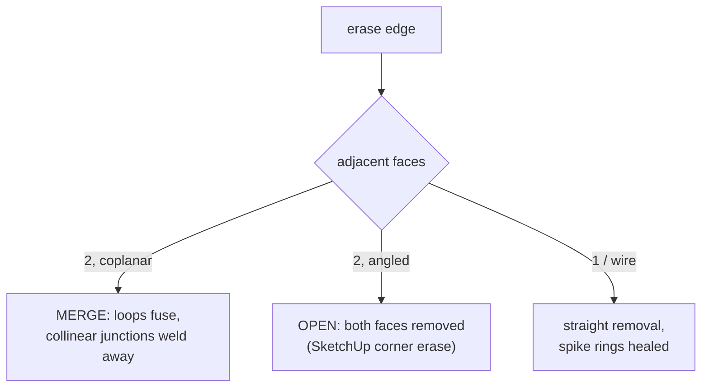

Ctrl+erase **softens** instead: a display-only `hidden` flag — the line
disappears from the viewport but every face, boundary, weld and join still
sees it (geometry, lighting, materials and exports are untouched).
Edit ▸ Unhide All restores them.

## 6. Push/Pull — the sweep kernel

One operation builds walls, slabs, columns, beams — the SketchUp workhorse:

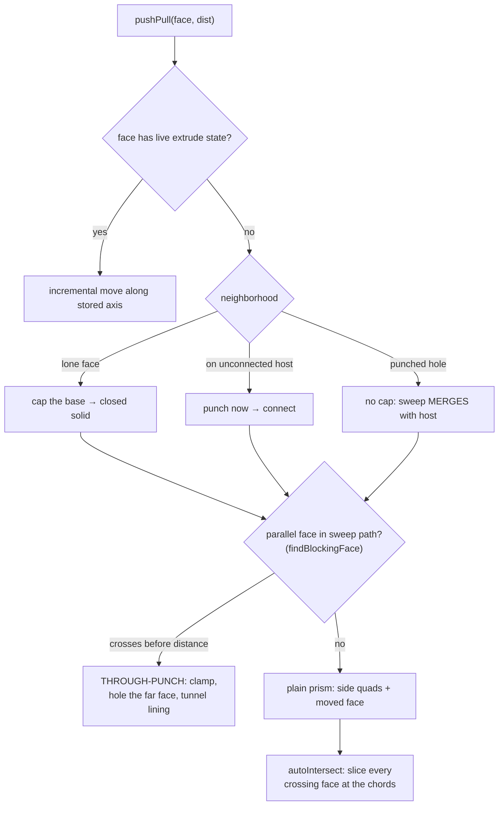

Post-sweep hygiene: coplanar twins are culled (unions leave no internal
partitions), and `shellVolume` resolves each orientation tree's sign
geometrically (ray-parity probe), so punched hosts + rising tubes measure
exactly.

## 7. Parametric BIM layer

Precise Drawing wraps kernel solids in **parametric entities**
(`model.bimEntities`): `{id, type, params, faces, edges}`. Every created
face/edge carries `userData {bimEntityId, bimType, role}`.

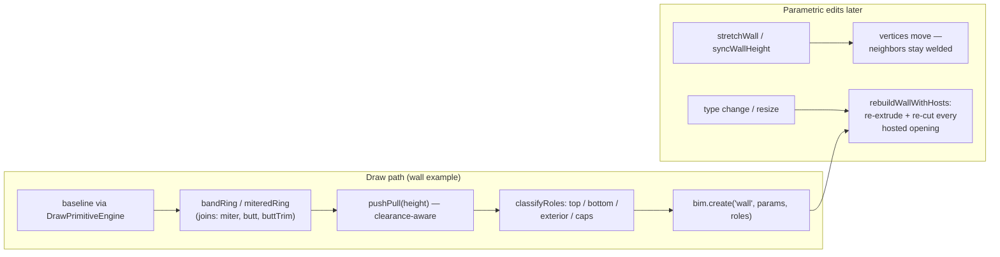

Levels are vertical datums (`LevelManager`); walls, slabs, beams and columns
derive their vertical bounds from levels + instance offsets.

## 8. Hosted openings (doors / windows)

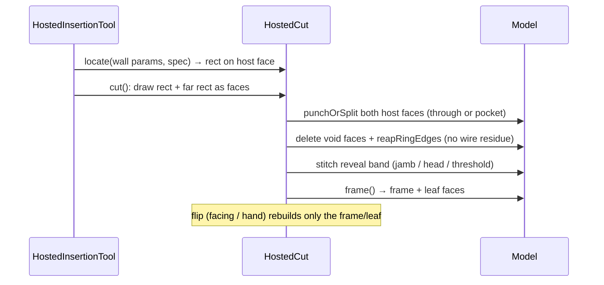

### 8a. Scripted Elements & downloaded assets

Two extension paths deliberately avoid touching the kernel:

- **Scripted Elements** (`js/script-elements.js`): a user script is a JS
  expression `({ name, placement, params, build(c) })`, compiled with
  `new Function` and run through the SAME kernel calls the built-in tools
  use — `buildInto()` diffs the model before/after to collect the created
  faces/edges, every face gets a role, and `bim.create('script', …)` turns
  the result into a parametric entity. Declared params render as editable
  Entity Info inputs; editing re-runs `buildInto` in a transaction. Source
  text persists in the IndexedDB `scripts` store (v3) and recompiles on
  load. `ScriptPlaceTool` places it — the drag ghost is real geometry built
  under `bimHold` + `noAutoIntersect`, throttled to ~14 builds/s with
  snap-input dedupe.
- **BlenderKit assets** (`js/assets.js`): downloaded GLBs live as foreign
  `THREE.Group`s under a dedicated root — serialized by hash, not by
  geometry. `healMaterials` repairs the two recurring import defects
  (WebP-decoded black albedo via canvas sampling, all-zero COLOR_0).
  Assets defined as Door/Window become hosted insertions that cut their
  host wall through the same `HostedCut` machinery above, fitted uniformly
  to the opening and re-cut when the wall rebuilds.

## 9. Structural elements & dynamic walls

`StructuralManager` (pure module, `app.structural` facade) implements the
elevation datums, the parametric beam sections, infill-wall clearance and
the join-priority takeoff:

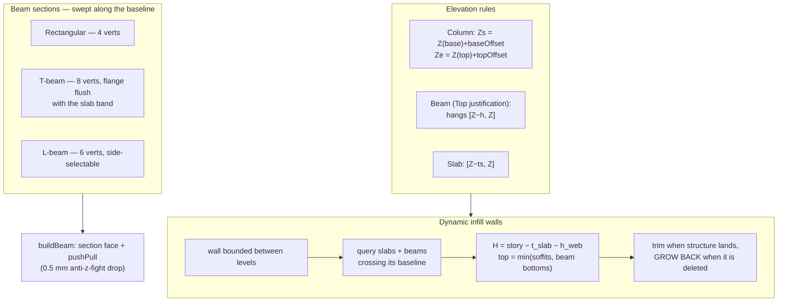

Join priority — enforced constructively (slabs punched at columns, walls
terminating under beams) and in the quantity takeoff (exact prism clipping,
overlap credited to the higher-precedence element):


Construction-wire hygiene: `bimHold` is a depth-counted bracket — edges born
during a BIM operation and left attached to no face are reaped on release;
wall commits and join rebuilds carry wider `beginEdgeSweep / endEdgeSweep`
brackets across their multi-phase flow. Free-drawn lines (born outside any
hold) are never touched. A manual **Edit ▸ Clean Up Stray Lines** command
purges any remaining wire edges in one undoable step.

## 10. Rendering pipeline

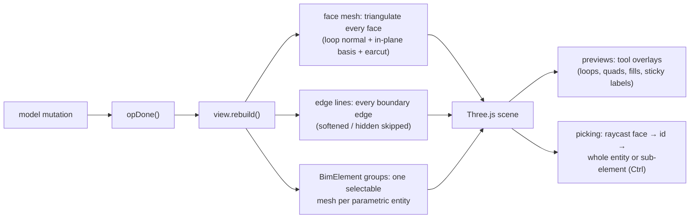

## 11. Persistence & export

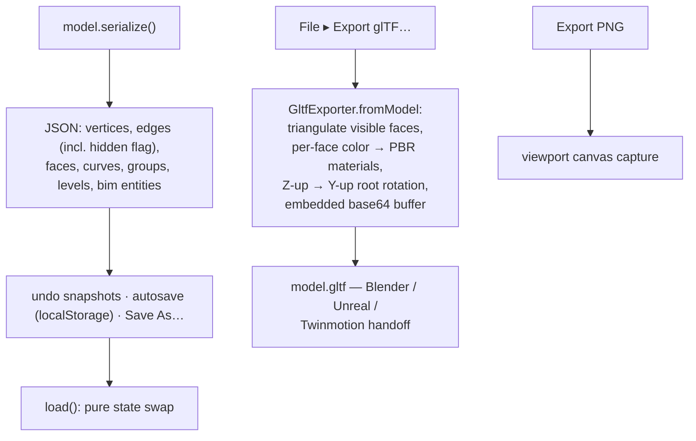

Softened edges and hidden faces are display state — never written to glTF,
so lighting and materials are unaffected by what you hide while modeling.

## 12. Testing

`node test/run.js` — 169 tests, no DOM, no WebGL: `geometry.js`, `model.js`
and the pure modules are loaded into an isolated V8 context (`vm`) and
driven through their public APIs. Suites cover the healing kernel (punch /
trim / arrange / dissolve), push/pull semantics, transactions, walls &
joins, hosted cuts, structural elements (elevation rules, profiles,
clearance, priority takeoff), wire hygiene, soften round-trip and the glTF
writer.

## 13. Feature SDK (extension surface)

The drawing engine is organized so that new features plug in without
touching internals. Three layers with a strict downward dependency rule:

```
┌──────────────────────────────────────────────────────────────┐
│  FEATURES (tools, BIM elements, UI extensions)               │  ← you write here
│    js/features/*.js — one file per feature                   │
├──────────────────────────────────────────────────────────────┤
│  SDK  (js/engine/api.js)                                     │
│    Engine.events    pub/sub bus (push invalidation)          │
│    Engine.features  registry: declarative descriptors        │
│    Engine.tx        transaction guard (validate-on-commit)   │
│    Engine.registry  feeds TOOLS / ribbon / commands / UI     │
├──────────────────────────────────────────────────────────────┤
│  KERNEL (existing, stabilized)                               │
│    js/geometry.js  pure math — no state, fully tested        │
│    js/model.js     B-Rep + topological ops + validate()      │
│    js/render.js    viewport + picking                        │
│    js/app.js       transactions, undo, entities, inference   │
└──────────────────────────────────────────────────────────────┘
```

### Rules

1. **Features never import kernel internals** — they talk to `app.model`
   and `app.transaction` through the SDK surface, and register themselves
   with a declarative descriptor. The kernel never knows a feature exists.
2. **Everything mutates through a transaction** (`app.run(label, fn)`). The
   transaction guard validates structure on commit and rolls back on
   *errors* (warnings are advisory) — corrupt state cannot enter the model.
3. **All change notification is push.** `Engine.events` emits
   `model:changed`, `entities:changed`, `selection:changed`,
   `tool:changed`, `feature:registered`. UI listens instead of polling.
4. **Snapshots are deep** (see model.js serialize) and undo is a pure
   state swap — no inverse operations to write or get wrong.

### Writing a new feature (the whole contract)

```js
Engine.features.register({
  id: 'beam',                       // unique — registry refuses duplicates
  kind: 'tool',                     // 'tool' | 'panel' | 'command'
  label: 'Beam', icon: '<svg…/>', key: 'B', mode: 'bim',
  commands: ['beam', 'bm'],         // command-bar aliases, free
  options: [                        // options-bar + properties fields, free
    { key: 'width',  type: 'number', label: 'Width',  step: 0.05, default: 0.2 },
    { key: 'height', type: 'number', label: 'Height', step: 0.05, default: 0.4 },
  ],
  tool: BeamTool,                   // standard Tool lifecycle class
  state: { width: 0.2, height: 0.4 }, // feature-owned, injected on activate
});
```

The registry validates the descriptor (shape, unique id, options schema) and
wires: the ribbon button, the command aliases, the options-bar fields bound
to `state` (with `onOption` hooks), the type-selector slot, and undo labels.
A malformed descriptor is refused loudly — the app never sees a half-wired
feature.

### Event bus

```js
const off = Engine.events.on('model:changed', e => render(e.dirty));
Engine.events.emit('model:changed', { label: 'wall', dirty: [...] });
off();
```

Listener exceptions are caught and logged — one bad listener can never break
an emitter. Events are synchronous (ordering is deterministic); async work
lives inside features, not the bus.

### Security / robustness model

- **Schema gates** — descriptors and JSON families are validated on entry.
- **Transaction guard** — structural `validate()` errors on commit roll the
  edit back; the toast names the failed operation.
- **Listener isolation** — bus handlers run in try/catch.
- **Deep snapshots** — undo state can't alias live arrays.
- **No eval / no remote code** — families are data (OBJ/primitives), never
  scripts; JSON parses are wrapped and refused on bad shape.

### Performance path

Current: single merged render mesh rebuilt per commit (fine to a few
thousand faces), O(N) picking via Three.js raycast, string-diffed UI panels.

Next steps, in order of value:
1. **Versioned rebuilds** — `model.version` bumps on every mutation;
   `view.rebuild()` early-exits when the version is unchanged.
2. **Incremental triangulation** — per-face triangle cache; a commit only
   re-triangulates faces whose ids changed (`model:changed` carries `dirty`).
3. **Spatial hash** — uniform-grid AABB index over faces for broad-phase
   intersection and hover picking; maintained by the same dirty set.
4. **Worker offload** — validate() and heavy booleans in a Web Worker once
   the kernel is moduleized (the SDK surface makes this a swap, not a
   rewrite).

### BIM storage & element layer (v2)

The Revit-style hierarchy sits beside the kernel without piercing it:

```
FEATURES   ui-browser.js (palette) · edit-inplace.js (sandbox) · BimElement.js
           (unified Groups, sub-element query, catalog mapping)
SDK        Engine.events: db:ready · editinplace:{entered,finished,cancelled}
FACADE     app.db (BimDatabase) · app.elements (BimElementRegistry)
           app.enterEditInPlace/finish/cancel · app.syncElementsToDb
KERNEL     model.js serializeSubset exports each element's B-Rep; hidden flags
           isolate the sandbox (the kernel already skips hidden geometry)
```

- **db.js** is a pure storage layer: relational tables (categories/families/
  types/elements) over an adapter — IndexedDB in the browser, an in-memory
  Map store under Node. Same code, fully testable headlessly.
- **The model stays the working set.** The database is a mirror: every
  commit upserts each entity's brep_data + quantities; detach/delete removes
  rows; catalog types are created on demand for unmatched sizes.
- **One element = one Group** (`render.elementsRoot`). The merged face mesh
  renders only plain Free-Drawing geometry; `pickFaceAt` raycasts the merged
  mesh AND every element Group, so element picking needs no parallel
  selection system.
- **Edit In Place** is visibility-based isolation plus `model.bimHold`, so
  structural edits keep their stamps; finish() re-derives ownership as
  "stamped ∪ created-since-entry", which is also the re-isolation rule
  applied after in-session undo/redo (snapshots carry no hidden flags).
