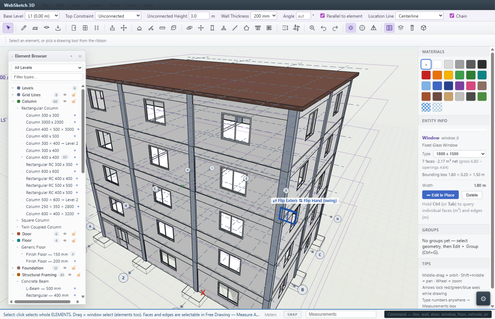
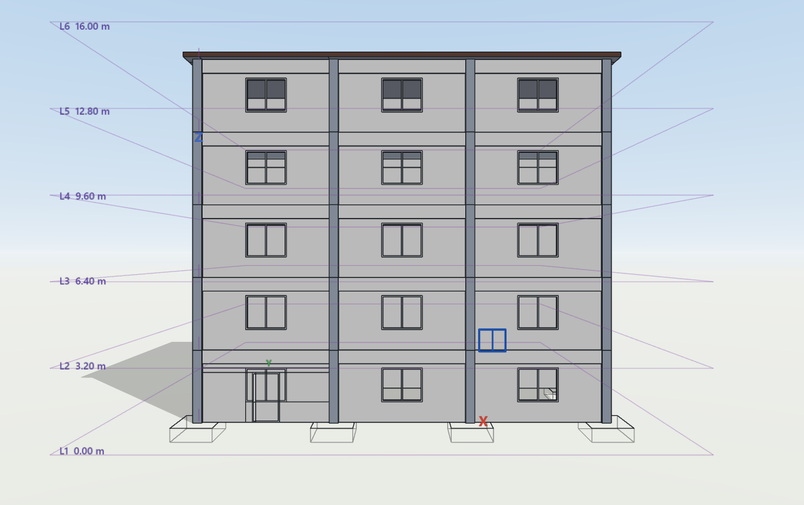
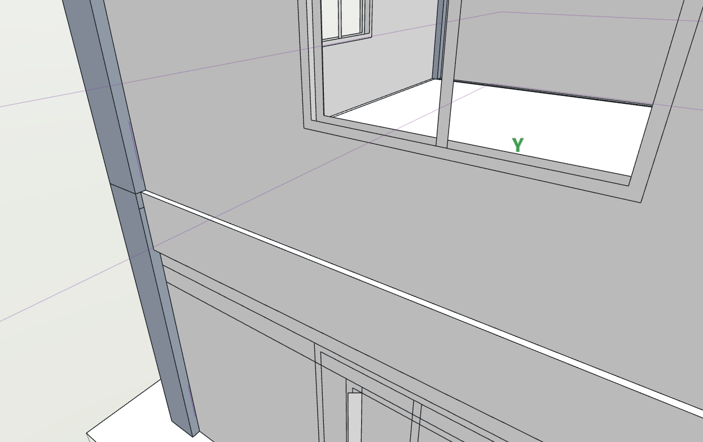
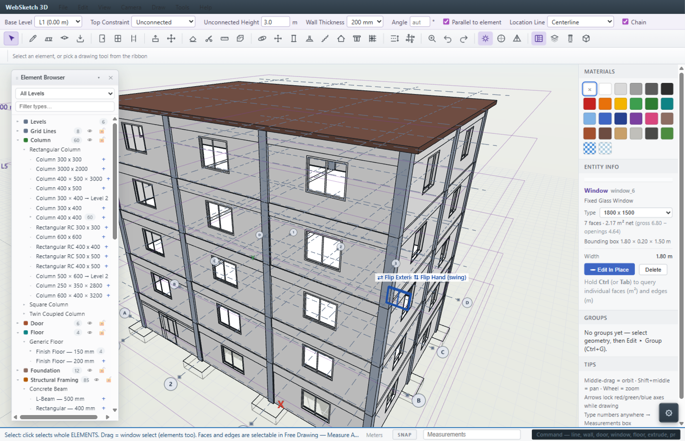
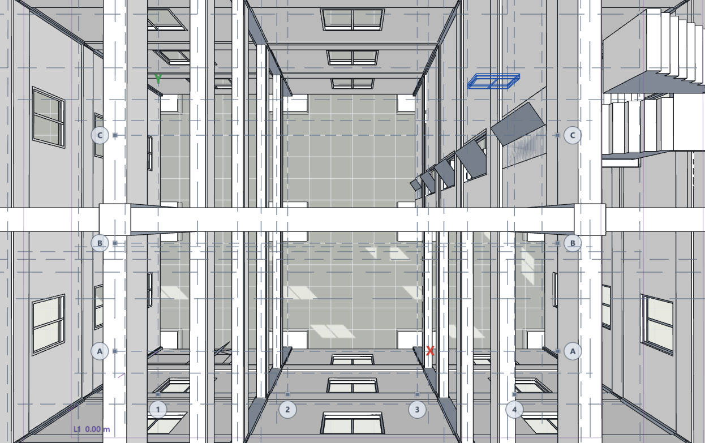
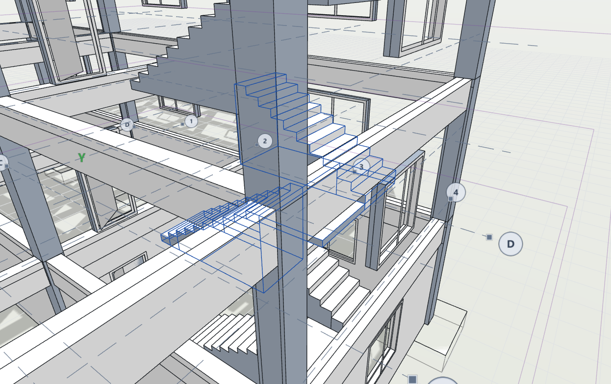

# WebSketch 3D — Portfolio Write-up

**A SketchUp-style modeler and Revit-style parametric BIM app, built from scratch in vanilla JavaScript + Three.js — no frameworks, no build step, no CAD libraries.**

This folder holds the screenshots and the project explanation for a job-application portfolio. The full source is the repository itself — run it with `python _dev_server.py` from the repo root and open http://localhost:8642/.

## Screenshots

All shots are of the **5-story demo building** loaded via **File ▸ Load 5-Story Building** — 292 BIM elements (12 foundations, 60 columns, 85 beams, 70 walls, 4 slabs + roof, 50 windows, 6 doors, 4 stairs) built through the app's own public tool API on an A–D / 1–3 structural grid.

| Image | What it shows |
|---|---|
|  | **Hero shot** — the whole building in context with its structural grid and exposed foundations. |
|  | **Front elevation** — five stories of repeating window bays, the 3-bay entrance, and level datums L1 0.00 m → LS 16.00 m down the left edge. |
|  | **Corner close-up** — column/beam/slab junctions, windows cut into the walls, footing pads at ground. |
|  | **The application UI** — a window selected (blue highlight) with the Entity Info card open (Category/Family/Type selector, dimensions, sill), the ribbon toolbar, and the Element Browser. Evidence it's a real application, not just a 3D render. |
|  | **Floor plan** — top view with slabs hidden: walls form rooms, columns read as squares at grid intersections, the stair shaft and entrance are visible, grid bubbles A–D / 1–3. |
|  | **Stair cutaway** — roof and upper walls hidden to open the shaft: four dog-leg flights stacked level over level inside the column/beam frame, one flight selected. |

## What the app is

WebSketch 3D is a single-page web app that fuses two tools that normally live in separate products:

1. **A SketchUp-style free-form modeler** — push/pull, line/rect/circle/arc/polygon, offset, scale, rotate, paint, groups and solids — running on a **custom B-Rep kernel** (faces/edges/vertices topology, automatic face–face intersection welding, planar arrangement of overlapping shapes, self-healing topology after edits).
2. **A Revit-style parametric BIM layer ("Precise Drawing")** — walls, columns, beams, slabs, foundations, roofs, doors, windows, openings, and stairs as registered elements whose **parameters — not geometry — are the source of truth**; editing a parameter regenerates the geometry and re-applies the element rules.

It has the interaction habits of real CAD: two selection modes (Free Drawing selects raw faces/edges; Precise Drawing selects whole elements), an inference/snap engine (endpoints, midpoints, on-face, axis alignment, plus hidden **centerlines** of walls/beams/columns), a numeric input box (VCB) parsing m/cm/mm/ft/in, Base Level / Top Constraint placement, editable levels and named grids, a Category ➔ Family ➔ Type catalog in IndexedDB with dynamic type creation, undo history, autosave, quantity takeoff, and glTF export.

## What the demo building demonstrates

The screenshots above are not hand-modeled — the demo is built by `js/features/demo5.js` through the same API a user drives, in correct construction order: footings → columns → walls → doors + windows → per-level slab + stair → beams → roof. The behaviors visible in the shots are enforced by the BIM engine, not scripted per-element:

- **Walls end at column faces** (5 mm reveal) and span **floor-to-beam-soffit** (2.595 m under every 3.20 m level with 0.6 m beams) — and walls re-close when an intruding column is deleted.
- **Beams hang from their reference level** with Top justification, so the level datum is the single source of vertical truth.
- **Doors and windows are hosted insertions**: they cut their host wall with watertight reveal bands, carry frames, and re-cut automatically when the wall is stretched or moved.
- **Stair shafts punch holes through slabs** that survive slab regeneration, and stair geometry (riser/tread) is checked against the IBC 2R+T comfort rule; each stair is editable in Entity Info (width, step count, landing depth, glass handrail toggle).
- **Slab punches at columns are oversized by 3 mm** so punched faces never weld coplanar with column tops — the fix for the classic "missing top face" kernel bug.

## Technical highlights

- **Custom B-Rep kernel, no CAD library** (`js/geometry.js`, `js/model.js`) — ring-defined faces, push/pull sweeps with SketchUp merge semantics, automatic 3D face–face intersection, welding invariants (no T-junctions in either direction), a topology validator (`model.validate()` with a watertight Euler check), and self-healing after element deletion (orphan-edge and empty-face reaping).
- **"Params are truth" regeneration** — every element rebuilds from its parameters; free-mode edits and BIM edits funnel into one transaction manager that enforces invariants, element rules, undo snapshots, and the IndexedDB mirror.
- **Element identity survives topology changes** — monotonic never-recycled IDs, join re-pointing when walls split/merge, role stamps (`top|exterior|start_cap|…`) on every face, so hosted elements stay bound to the right host.
- **Extensible without rebuilding** — Scripted Elements turn pasted AI-generated code into parametric element types whose declared parameters appear as editable Entity Info inputs; the shipped Fire Stair example is a working dog-leg egress stair.
- **307 passing unit tests** on a dependency-free Node harness (`node test/run.js`), covering the kernel, wall/column rules, hosted cuts with exact volumes, snap tiers, stair math, floor openings, column rotation, selection modes — and a regression suite that rebuilds the entire 5-story building and asserts its validity.

## Stack & architecture

- **Vanilla JavaScript + Three.js r128** (local copy), browser-global scripts — no framework, no bundler, no npm dependencies to install, runs from a static server or even `file://`.
- Modules attach by constructor: `View` (render/camera/HUD/overlays), `BimEntityManager` (elements, snaps, catalog), `StructuralManager` (pure module building column/beam/slab/wall/footing geometry with the vertical datum rules), tool classes (Free 17 + BIM family), and the app shell (menus, ribbon, transactions, autosave, IndexedDB mirror).
- Deep-dive docs live in [docs/ARCHITECTURE.md](../ARCHITECTURE.md) (layering, kernel flowcharts, BIM layer, export pipelines).

## Challenges & decisions

(The parts an interviewer tends to probe.)

**Coplanar welding.** Faces of intersecting solids that land in the same plane used to weld together, so deleting one element tore its neighbor's topology. The kernel now keeps millimeter-scale reveal gaps between intersecting elements (5 mm structural separations, 3 mm oversized punches, 0.5 mm beam z-drop) — the same tolerance-gap trick production CAD systems use. It kept every element's topology independent while looking physically joined, and eliminated a whole class of "missing face" bugs.

**Performance is the current frontier.** Kernel ops and the post-op invariant sweeps are O(total model): at ~3,600 faces, deleting one window triggers a ~30 s synchronous cascade (host wall rebuild + full-model validation pass + undo snapshot serialization), and building the demo takes ~65 s (staged with a progress UI so the page stays alive). The roadmap is a spatial index so operations touch only their neighborhood, and moving invariant sweeps off the render thread. It's deliberately not a rushed "add an index" patch — the sweep architecture has to change first.

**Element identity vs topology identity.** When walls intersect, split, or merge, their faces are recreated — but the BIM element IDs persist (join re-pointing, never-recycled ID counter), which is what keeps doors, windows, selection, and undo bound to the right host across topology churn. Getting this right is most of the wall/column interaction test suite.

**Why a from-scratch kernel?** A parallel C++/Qt + Open CASCADE (OCCT) desktop rewrite existed for a while — it validated the B-Rep approach but doubled the maintenance surface and fought the lightweight web interaction model, so it was archived and deleted to focus on one codebase. The hand-rolled JS kernel buys full control: topology debuggable in DevTools, no serialization boundary, geometry math as first-party code. The cost is maturity — see the performance section above.

## Run it

```bash
git clone <this repo>
cd <repo folder>
python _dev_server.py
# open http://localhost:8642/
# File ▸ Load 5-Story Building  (about a minute, with progress)
# tests: node test/run.js
```
